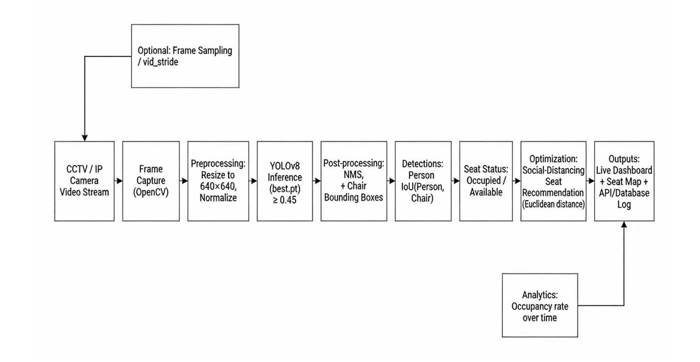

<div align="center">

# Real-Time Library Seat Occupancy Detection

*"Smart Campus Seating Optimization via Spatial Logic"*


</div>

> **ℹ️ Note**
>
> The **core deep learning pipeline and spatial logic layer are 100% complete and tested**. The real-time web application integration (Next.js/ONNX) is currently in active development.

---

## ✨ What is this project?

This system is an AI-powered smart campus solution that helps students find available study spaces while optimizing for social distancing. Unlike standard surveillance models that just count "people," this system uses a custom **Heuristic Spatial Logic Layer** to actively map the relationship between students and furniture, providing highly accurate, real-time occupancy data.

---

## 🎯 Two Powerful Features

| Spatial Verification ✅ | Social Distancing Optimizer 📏 |
| :--- | :--- |
| *"Is this seat actually taken?"* | *"Where is the safest place to sit?"* |
| Goes beyond basic object detection. Calculates Intersection over Union (IoU) between "person" and "chair".If overlap > 0.30, the seat is occupied. | Processes detection data to calculate Euclidean distances between available seats, recommending the optimal empty seat. |
| **Status: Complete** | **Status: Complete** |

---

## 🏗️ System Architecture

*(flowchart)*
<div align="center">
  
</div>

### Data Flow
`Camera Stream` ➔ `YOLOv8 Inference` ➔ `NMS & Bounding Boxes` ➔ `IoU Spatial Logic` ➔ `Euclidean Optimization` ➔ `Live Dashboard` 

---

## 📊 Current Progress

| Component | Status | Progress |
| :--- | :--- | :--- |
| 🪑 **Custom YOLOv8 Training (best.pt)** | ✅ Complete | 100% |
| 📐 **IoU Spatial Logic Layer** | ✅ Complete | 100% |
| 📏 **Distance Recommendation Engine** | ✅ Complete | 100% |
| 🎥 **OpenCV Live Video Dashboard** | ✅ Complete | 100% |
| 🌐 **Next.js Web GUI** | 🚧 In Progress | 20% |
| ⚡ **ONNX Web Browser Inference** | 🚧 In Progress | 10% |

---

## 🛠️ Technology Stack

| Layer | Technology |
| :--- | :--- |
| **Object Detection** | YOLOv8 (Ultralytics) |
| **Deep Learning Framework** | PyTorch 2.5.1 (CUDA 12.1)  |
| **Video Processing** | OpenCV (DirectShow backend)  |
| **Spatial Math** | NumPy & SciPy  |
| **Hardware Tested** | NVIDIA GeForce RTX 3060 (6GB VRAM)  |
| **Dataset** | Roboflow Library-Seat-v2 (2,046 Train / 196 Val images)  |

---

## 📈 Model Performance (Validation Metrics)

The system is highly optimized for edge devices, achieving real-time speeds without sacrificing accuracy.

| Metric | Score | Timing | Speed (ms/image) |
| :--- | :--- | :--- | :--- |
| **Precision (P)** | 0.806  | **Preprocess** | 0.3 ms  |
| **Recall (R)** | 0.761  | **Inference** | 3.5 ms |
| **mAP50** | 0.773  | **Postprocess** | 3.7 ms |

---
<br/>

## 👥 Development Team

This research and engineering project was developed by:

| Name | Institution | GitHub |
| :--- | :--- | :--- |
| **Osama Ibn Mahfuz** | Shanghai University of Engineering Science | [](https://github.com/OsamaIM) |

<br/>

## 🚀 Quick Start

```bash
# Clone the repository
git clone [https://github.com/OsamaIM/Library_Seat_Occupancy.git](https://github.com/OsamaIM/Library_Seat_Occupancy.git)
cd Library_Seat_Occupancy

# Install dependencies
pip install -r requirements.txt

# Run the live webcam detection
python main.py
